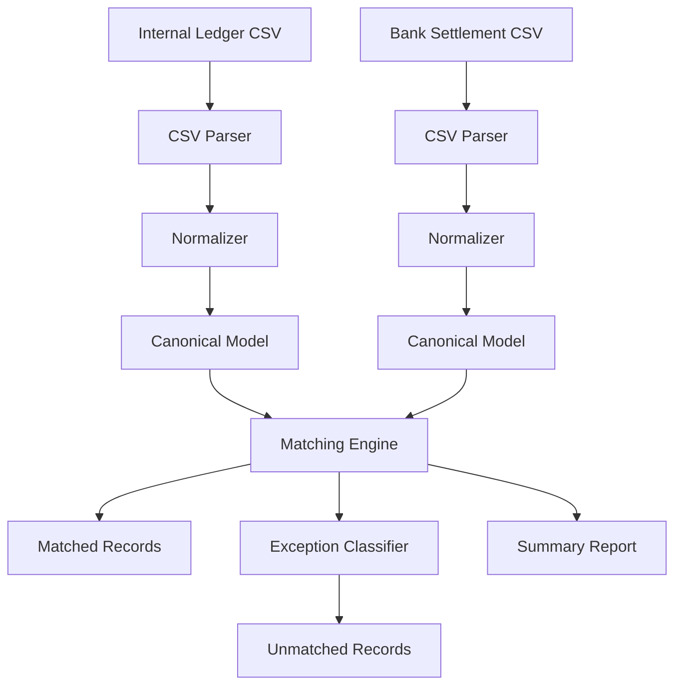

# High-Level Design

## System Architecture
The reconciliation engine follows a modular pipeline architecture, ensuring that ingestion, processing, and reporting are decoupled.

### 1. Ingestion Layer
- **Parsers:** Responsible for reading raw files (CSV, and future MT940/CAMT.053).
- **Validators:** Ensures required fields are present before processing.

### 2. Normalization Layer
- **Normalizers:** Maps source-specific fields (e.g., "TXN_REF" vs "Reference") into the **Canonical Transaction Model**.
- **Transformation:** Handles currency formatting, date parsing, and amount normalization.

### 3. Reconciliation Engine
- **Matcher:** Executes matching logic. Phase 1 uses **Exact Match** logic.
- **Exception Classifier:** Deterministic rules to label unmatched records.

### 4. Reporting Layer
- **Summary Generator:** Aggregates statistics (Match Rate, Exception Counts).
- **Output Writers:** Produces CSV matched lists, exception lists, and audit logs.

## Component Diagram Idea

## Key Design Principles
- **Canonicalization First:** All data is converted to a standard format before matching.
- **Immutability:** Original records are preserved; matches are recorded as new associations.
- **Auditability:** Every step is logged to ensure financial integrity.
